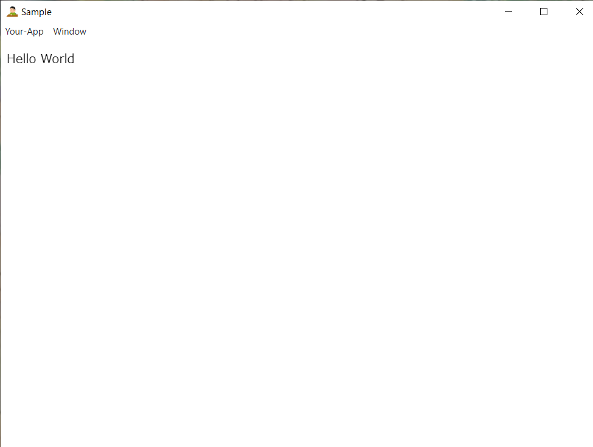

# electron_test
エレクトロンを使って、"簡単なゲームを動かせるようにするまで"がなんとなくの目標

## インストール方法(Windows)
[これ](release/nayamu_boy%20Setup%201.0.0.exe)がrelease直下にあるので、それを使ってインストール

## インストール方法(ほかのOS)
このレポジトリをclone or zip でダウンロードして解凍してから、このレポジトリのフォルダまで来てから

```sh
npm -i electron
```

してから

```sh
electorn .
```

とかすれば行けると思う..

こんな感じになる

